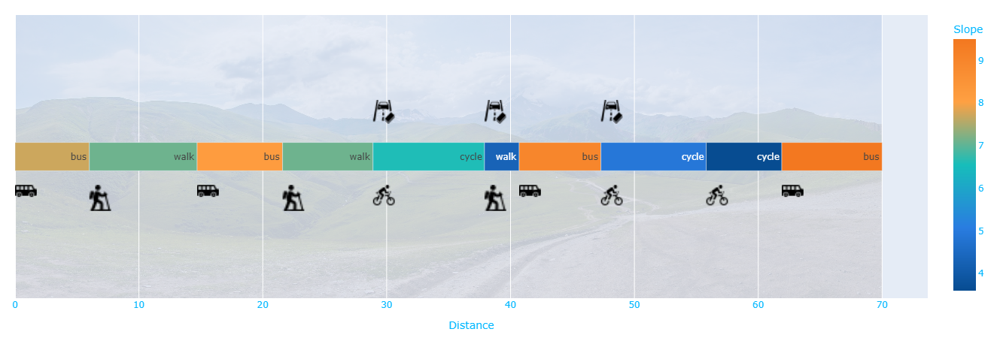

# Tour Planning

A demonstration of using hard and soft constraints on the Leap quantum-classical
hybrid constrained quadratic (CQM) solver.

This example solves a problem of selecting, for a tour divided into several legs
of varying lengths and steepness, a combination of locomotion modes (walking,
cycling, bussing, and driving) such that one can gain the greatest benefit of
outdoor exercise while not exceeding one's budget of transportation costs and time.  



## Hard and Soft Constraints

Constraints for optimization problems are often categorized as either “hard” or
“soft”.

Any hard constraint  must be satisfied for a solution of the problem to qualify
as feasible. Soft constraints may be violated to achieve an overall good solution.

By setting appropriate weights to soft constraints in comparison to the objective
and to other soft constraints, you can express the relative importance of such
constraints.

## Installation

This example can be run in the Leap IDE by accessing the following URL:

    https://ide.dwavesys.io/#https://github.com/dwave-examples/tour-planning


Alternatively, install requirements locally. Ideally, in a virtual environment.

    pip install -r requirements.txt

## Usage

To run the demo:

```bash
python app.py
```

Access the user interface with your browser at http://127.0.0.1:8050/.

The demo program opens an interface where you can configure tour
problems, submit these problems to a CQM solver, and examine the results.

Hover over an input field to see a description of the input and its range of
supported values.

### Configuring the Tour

The upper left section of the user interface lets you configure the tour: how 
many legs it should comprise, lengths of these legs, and maximum elevation gain.

The lengths of each leg are set to a uniform random value between your selected
minimum and maximum lengths. Steepness is set uniformly at random between zero
and the maximum you set.

A leg's steepness affects cycling: a constraint is set to discourage (soft) or
disallow (hard) cycling on legs that exceed half the maximum steeps you set.

Additionally, you can configure your budgets of cost (modes of locomotion
vary in price) and time (walking is slower than driving) for the entire tour.

### Configuring the CQM

The upper middle section of the user interface lets you configure the constrained
quadratic model used to select the modes of locomotion for each leg of the tour.

For the constraints on cost, time, and steepness you can select whether to
use hard or soft constraints. For soft constraints, you can set a weight and
a type of penalty: linear or quadratic.

### Submitting the Problem for Solution

The upper right section of the user interface lets you submit your problem
